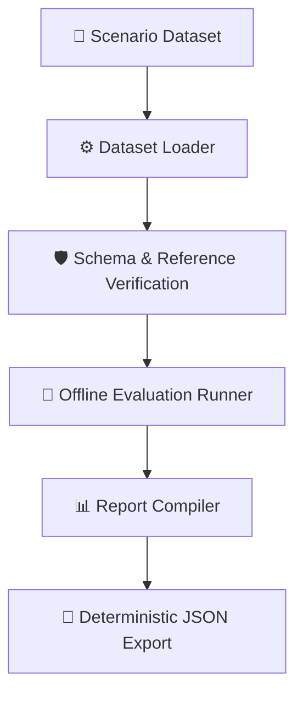

# OpsGraph AI — v0.9.0 Release Notes

OpsGraph AI `v0.9.0` introduces a comprehensive, offline-safe, deterministic **Evaluation and Benchmarking Framework** (Phase 9) to measure root-cause reasoning, telemetry citation, evidence collection, and execution budget compliance.

---

## 1. Overview and Architecture

The Phase 9 framework enables systematic, offline validation of model SRE incident troubleshooting. It decouples the evaluation logic from the live LangGraph runtime, allowing offline validation of incident traces against scenario golden labels.

---

## 2. Major Capabilities

### 1. Typed Evaluation Contracts (`evals/schemas.py`)
Provides strict, validated Pydantic models for evaluation inputs and outputs:
*   `GoldenScenario`: Scenario expectations including dataset split, incident ID, acceptable outcomes, required/acceptable/forbidden tools, and structured root-cause labels.
*   `EvaluationTrace`: Runtime state records including node sequences, execution budgets, timing records, and tool execution diagnostic logs.
*   `DatasetEvaluationResult` & `BenchmarkResult`: Structured envelopes for aggregated stats, metric summaries, and validation records.

### 2. Pure Deterministic Metrics (`evals/deterministic_metrics.py`, `evals/rca_metrics.py`, `evals/tool_metrics.py`)
Pure function metrics that assess specific operational boundaries:
*   **Citation ID Validity**: Ratio of valid telemetry citations against the incident's evidence universe.
*   **Required Evidence Recall**: Percentage of required telemetry evidence items correctly identified.
*   **Terminal State Correctness**: Validation that the final model-selected path matches scenario allowlists.
*   **Budget Compliance**: Multi-dimensional compliance scoring for investigation iteration depth, tool invocation limits, and context rebuild counters.
*   **Known Secret Leakage Detection**: Scans outputs for predefined credentials and authorization bearer tokens.
*   **Structured RCA Correctness**: Standardized normalizations to match predicted affected services, fault categories, and root-cause codes against golden expectations.
*   **Tool Selection Precision & Recall**: Detailed tool checks classifying required, acceptable, forbidden, and unnecessary tool calls.

### 3. Sequential Evaluation Runner (`evals/runner.py`)
Orchestrates sequential metric computation to preserve test-to-test isolation. Handles missing traces or labels gracefully with warnings, and captures fatal exceptions inside results without crashing the pipeline.

### 4. Deterministic Dataset Loader (`evals/dataset_loader.py`)
Discovers scenario definitions in nested directories, performs compatibility mappings, and validates references. Sorts discovered files/folders and final scenario collections ascending by scenario ID to guarantee OS-independent behavior.

### 5. Report Compiler (`evals/report_compiler.py`)
Aggregates scenario results into dataset-level statistics. Groups warnings and errors by standard category names, and computes minimum, maximum, mean, and median stats for each metric independently without computing composite quality scores.

### 6. Benchmark Execution Engine (`evals/benchmark.py` & `evals/export.py`)
A coordinate facade executing the entire loader -> validation -> runner -> compiler -> export pipeline. Produces deterministic, sorted JSON artifacts with standardized indentation.

---

## 3. CI and Deterministic Verification
*   **GitHub Actions Workflow (`.github/workflows/phase9.yml`)**: Automates testing, python packaging setup, and pytest suite execution for pull requests and pushes to `main` and `feature/phase-9-evaluation-framework`.
*   **Deterministic Artifact Test**: Validates that running identical benchmarks twice produces identical JSON payloads (disregarding random run IDs, timestamps, and path structures).

---

## 4. Repository Structure Update
*   `evals/`: Package containing evaluation contracts, metrics, runner, report compiler, and benchmark execution engine.
*   `tests/unit/`: Expanded with dedicated tests:
    *   `test_evaluation_schemas.py`
    *   `test_deterministic_metrics.py`
    *   `test_rca_metrics.py`
    *   `test_tool_metrics.py`
    *   `test_runner.py`
    *   `test_dataset_loader.py`
    *   `test_report_compiler.py`
    *   `test_benchmark.py`
    *   `test_deterministic_artifact_verification.py`

---

## 5. Known Limitations

*   **Runtime Execution Instrumentation**: Detailed runtime instrumentation (node timings, graph traversal traces, and critic execution traces) remains future work. The evaluation framework consumes existing execution traces but does not instrument runtime execution automatically.
*   **NeMo Guardrails**: Deferred due to local environment and python version constraints.
*   **Production Readiness**: Execution relies on command-line execution and static JSON exports.

---

## 6. Future Roadmap (Phase 10)
*   **Phase 10 — Evaluation Instrumentation**: Inject trace collectors directly into the runtime LangGraph investigation node transitions to collect live traces.
*   **CI Pipeline Integration**: Automatic benchmark execution triggered on routing logic commits to prevent regression.
*   **Structured Interactive Reports**: Lightweight presentation layer for dataset results.
