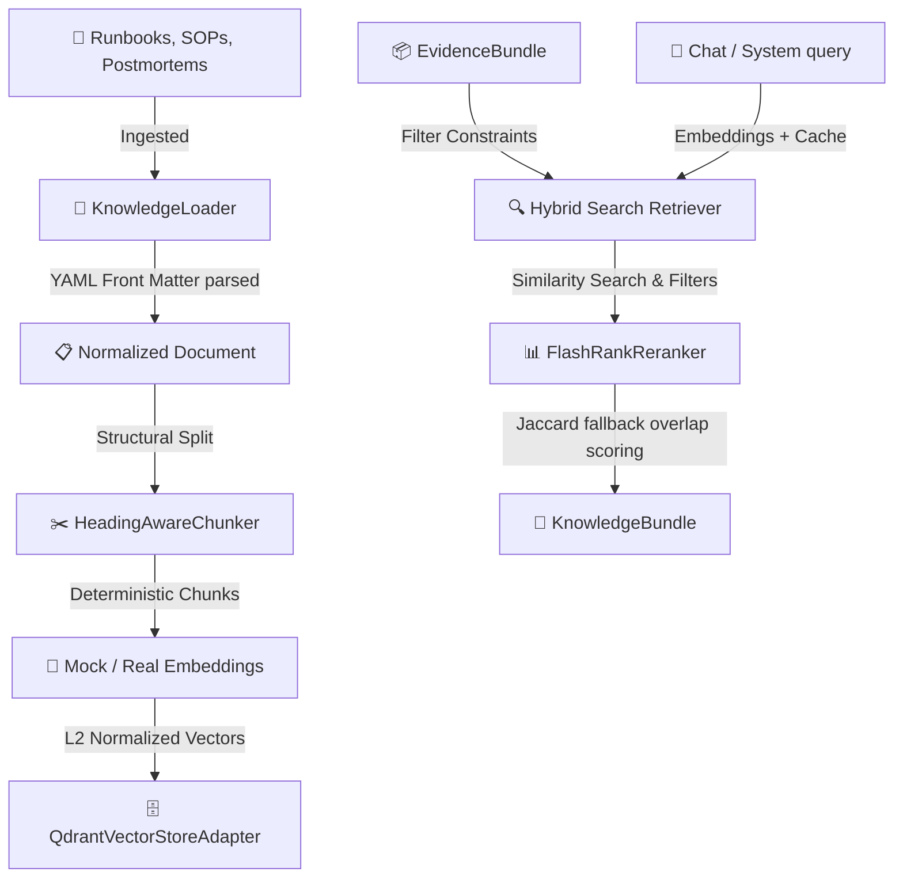

# Enterprise Knowledge Layer Architecture (RAG)
**Document Status:** Finalized (Phase 5 Complete)  
**Authoritative Reference:** Knowledge Ingestion, Indexing, and Retrieval Design  

---

## 1. Knowledge Flow Diagram

The Enterprise Knowledge Layer is responsible for building a deterministic, hybrid-search retrieve pipeline that serves verified diagnostic content to downstream agentic reasoning components.

---

## 2. Ingestion & Document Normalization
Documents are ingested from Markdown formats with standard YAML front-matter headers (like `RB-DB-001.md`). The parser (`KnowledgeLoader`):
1.  Extracts front-matter metadata parameters (`document_id`, `document_type`, `version`, `title`, `service_scope`, etc.) into a canonical schema.
2.  Normalizes content strings, eliminating raw platform dependencies or local file paths.
3.  Exposes clean `KnowledgeDocument` representations.

---

## 3. Chunking Strategy
To retain strict semantic limits and operational contexts:
*   **Heading-Aware Splitting**: The `HeadingAwareChunker` splits Markdown files by their heading levels (`# `, `## `, `### `). Sub-sections like `# Symptoms`, `# Investigation Steps`, and `# Remediation Options` become standalone chunks.
*   **Paragraph Preservation**: Paragraphs are not sliced randomly; splitting occurs cleanly at line breaks.
*   **Deterministic Chunk IDs**: Identifiers are assigned sequentially: `<DOCUMENT_ID>-CHUNK-<SEQ_NUM>` (e.g. `RB-DB-001-CHUNK-001`).
*   **Metadata Inheritance**: Every chunk inherits root front-matter attributes, such as `service_scope` and `version`, along with structural metadata like `section` name and `heading` line.

---

## 4. Embedding Strategy
The `BaseEmbeddingProvider` interface decouples vector generation from underlying provider clients:
*   **MockEmbeddingProvider**: Computes L2-normalized float vectors of configured dimensions (default: 3072) by seeding a pseudorandom number generator with the SHA-256 hash of the content. This yields deterministic, scale-invariant vectors that simulate cosine similarity calculations entirely offline.
*   **Future Providers**: Standardized wrappers can easily bind google-generativeai, Vertex AI, OpenAI, or Sentence Transformers.

---

## 5. Vector Store Abstraction
Decouples vector operations from specific databases via `BaseVectorStore`:
*   **QdrantAdapter**: Instantiates `QdrantClient(location=":memory:")` for offline testing/containers or connects via hosts.
*   **UUID Mapping Constraint**: Qdrant requires string point IDs to be valid UUIDs. The adapter implements a transparent, deterministic mapping using `uuid.uuid5` on string chunk IDs, saving the original chunk ID in the payload. It automatically reconstructs the original chunk ID during query retrieval.
*   **Future Databases**: Pineapple, pgvector, Weaviate, or Milvus can be added by implementing `BaseVectorStore`.

---

## 6. Hybrid Retrieval Pipeline
Coordinated by `HybridRetriever`:
1.  **Evidence-Driven Filtering**: Consumes an `EvidenceBundle` coverage summary. If specific services are affected (e.g., `checkout-service`), the retriever generates a filter: `{"service_scope": ["checkout-service"]}`, targeting only runbooks that match those scopes.
2.  **Cosine Similarity search**: Queries the Qdrant collection using vector search.
3.  **FlashRank Reranking**: Executes a local cross-encoder rerank on candidate chunks. If `flashrank` library is absent or fails to load, a Jaccard token overlap similarity fallback executes, keeping execution 100% resilient.

---

## 7. KnowledgeBundle Contract
Packaged results are stored inside immutable `KnowledgeBundle` models:
*   `chunks`: Frozen tuple of retrieved semantic chunks.
*   `retrieval_scores` & `rerank_scores`: Scoring maps tracing vector and cross-encoder outputs.
*   `applied_filters`: Filter conditions recorded for debugging.
*   `evidence_references`: Identifiers of the evidence triggering the scope.

---

## 8. Caching Policy
Exposed via `KnowledgeCache`:
*   *Embeddings*: Caches text hashes to avoid redundant embedding model API calls.
*   *Retrieval results*: Caches vector query keys to speed up repeated queries.
*   No caching of prompts or LLM outputs is allowed.
