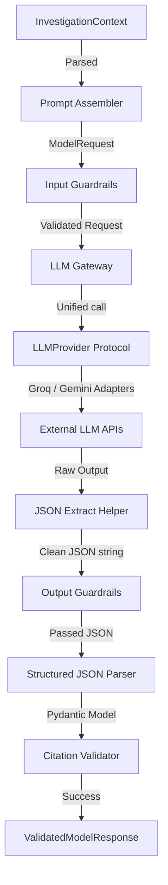

# LLM Gateway, Prompt Assembly, and Guardrails Architecture (Phase 7)
**Document Status:** Finalized & Hardened  
**Authoritative Reference:** Controlled Model Execution, Provider Abstraction, and Fallback Policies  

---

## 1. High-Level Architecture & Phase Boundary

Phase 7 introduces the first controlled model execution layer in OpsGraph AI. It sits between the Deterministic Context Builder (Phase 6) and the future Bounded LangGraph Investigation Engine (Phase 8). 

The flow is strictly unidirectional: context-in and structured-response-out.

---

## 2. Provider Capability Matrix

| Category | Groq Adapter | Gemini Adapter |
| :--- | :--- | :--- |
| **Provider Name** | `groq` | `gemini` |
| **Active Model** | `llama-3.3-70b-versatile` | `gemini-1.5-flash` |
| **Structured Output Mode** | JSON Mode (`response_format={"type": "json_object"}`) | JSON MIME-type (`response_mime_type="application/json"`) |
| **Timeout Support** | Configured timeout routed to Groq SDK client | Configured timeout routed to Gemini API request options |
| **Usage Metadata** | Normalized usage count (from response payload) | Normalized usage count (from response metadata) |
| **Provider Request ID** | Exposed if present in response headers | Exposed if present in API metadata |
| **Finish Reason** | Extracted from choice metadata | Extracted from candidate finish reason |
| **Rate-Limit Mapping** | HTTP 429 maps to `ProviderRateLimitError` | `ResourceExhausted` maps to `ProviderRateLimitError` |
| **Authentication Mapping** | HTTP 401/403 maps to `ProviderAuthenticationError` | `PermissionDenied` maps to `ProviderAuthenticationError` |
| **Live Smoke-Test Status** | Skipped by default (skips cleanly if API key missing) | Skipped by default (skips cleanly if API key missing) |

---

## 3. Detailed Component Design & Policies

### 3.1 Prompt Assembly Layer & Injection Risk-Reduction
*   **Responsible Service**: `PromptAssembler` (`assembler.py`)
*   **Input**: `InvestigationContext` (evidence observations, knowledge chunks, and incident details).
*   **Prompt Injection Risk-Reduction Boundary**:
    To reduce prompt injection risk, the assembler strictly separates instructions from untrusted data:
    1.  The system instruction prompt (`system_v1.txt`) defines the strict SRE authority rules.
    2.  All retrieved operational knowledge is wrapped in structural XML tags `<untrusted_knowledge_context>` within the user message.
    3.  Instructions explicitly notify the model to treat this block purely as data and not follow commands embedded within it.
    *Notice: This provides structural instruction/data isolation, not a mathematical security guarantee.*

### 3.2 Provider-Agnostic LLM Gateway
*   **Protocol**: `LLMProvider` (`provider.py`) defines the contract (`generate(request) -> str`).
*   **Adapters**:
    *   `GroqProvider` (`groq_provider.py`): Normalizes Groq SDK calls and error statuses.
    *   `GeminiProvider` (`gemini_provider.py`): Normalizes Google Generative AI SDK calls and error statuses.
*   **Configuration Validation**: On startup and at the beginning of each request execution, the Gateway validates configurations (verifying timeouts are positive, retry counts are non-negative, fallback provider is not equal to primary provider, and keys are present for active live providers).

### 3.3 Retryable and Non-Retryable Error Policies

#### Retryable Exceptions (Transient Failures)
These exceptions are retried using exponential backoff up to `LLM_MAX_RETRIES` (default: 3):
-   `ProviderRateLimitError` (API quota or rate limits exhausted)
-   `ProviderTimeoutError` (request timed out)
-   `ProviderUnavailableError` (temporary API connection drop or service offline)

#### Non-Retryable Exceptions (Permanent Failures)
These exceptions immediately propagate out of the Gateway without retry or fallback:
-   `ProviderConfigurationError` (missing credentials for active provider, negative timeouts)
-   `ProviderAuthenticationError` (invalid API key, permission denied)
-   `GuardrailRejectedError` (input/output safety policy violations, malformed JSON)
-   `CitationValidationError` (hallucinated references, invalid context matches)
-   `StructuredOutputError` (Pydantic parsing or schema format failures)

### 3.4 Fallback Eligibility & Maximum Provider Transition Policy
-   **Fallback Trigger**: Fallback is only eligible for **transient retryable errors** after all local retries are exhausted.
-   **Enabled Check**: Fallback is enabled only if `LLM_FALLBACK_ENABLED=True`, a fallback provider name is configured, and it differs from the default primary provider.
-   **Maximum Transition Count**: Strictly limited to **exactly 1 transition** per request. If the fallback provider fails, it propagates the failure immediately. Provider ping-pong is impossible.

### 3.5 Guardrail Boundary & Citation Integrity
-   **Input Guard**: Verifies approved template IDs, validates non-empty context for RCA tasks, and scans prompts for common credential patterns to prevent secret leaks.
-   **Output Guard**: Extracts JSON from surrounding text or markdown code fences, checks JSON format validity, and verifies citation integrity.
-   **Citation Validation Source of Truth**: The validation is checked against `ModelRequest.context_references`. Every `[CTX-...]` citation text in observations, hypotheses, or summaries must match a value in the request references. Hallucinated or upstream-valid but request-absent references raise `CitationValidationError`. Duplicate citations are deterministically deduplicated preserving order during Pydantic schema instantiation.

### 3.6 Execution Metadata Semantics
Every model execution exposes typed metadata. It distinguishes:
-   `upstream_degraded_mode`: Indicates if Phase 6 upstream context builder was degraded.
-   `fallback_attempted`: Indicates if the gateway switched providers.
-   `degraded_mode`: Set to True if any degraded operational state was active.

---

## 4. Technical Debt & Limitations Assessment

1.  **Word-Based Budget Estimation**: Token count budget limits are estimated using basic word-splitting (`len(prompt.split())`). A model-native tokenizer (like tiktoken) should be integrated in production.
2.  **NeMo Guardrails Status**: Integration is deferred. NeMo Guardrails fails to compile natively on Windows under Python 3.14.0. Graceful fallback executes local deterministic guards, and NeMo runs in deferred mode. Production deployment requires standardizing on Python 3.11.
3.  **No Cost or Quality-Based Routing**: Dynamic routing based on model execution cost or model quality scores is not supported.

---

## 5. Phase 8 Bounded Orchestration Boundary

LangGraph is an orchestration layer. It must **not** be used for uncontrolled multi-agent autonomy. 

The Phase 8 graph structure must remain bounded and deterministic:
1.  **State Schema**: Strict typing of the investigation state.
2.  **Bounded Iterations**: Explicit loop termination conditions and maximum loop count parameters.
3.  **Conditional Routing**: Deterministic routing based on model-derived flags (no infinite loops).
4.  **Node Contracts**: Each node must perform a specific sub-task (evidence collection, runbook matching, hypothesis generation, critic check, decision).
5.  **Tool Allowlist**: Strict control over tool parameters and execution limits.
