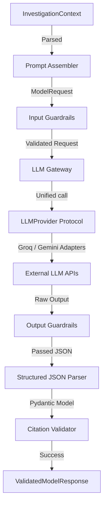

# LLM Gateway, Prompt Assembly, and Guardrails Architecture (Phase 7)
**Document Status:** Finalized (Phase 7 Implementation Complete)  
**Authoritative Reference:** Controlled Model Execution, Provider Abstraction, and Fallback Policies  

---

## 1. High-Level Architecture & Phase Boundary

Phase 7 introduces the first controlled model execution layer in OpsGraph AI. It sits between the Deterministic Context Builder (Phase 6) and the future LangGraph Investigation Engine (Phase 8). 

The flow is strictly unidirectional, context-in and structured-response-out.

---

## 2. Component Design & Responsibilities

### 2.1 Prompt Assembly Layer
*   **Responsible Service**: `PromptAssembler` (`assembler.py`)
*   **Input**: `InvestigationContext` (authoritative evidence, supporting knowledge, and gap details).
*   **Context Isolation (Prompt Injection Resistance)**: The assembler formats raw telemetry as observations. It strictly isolates retrieved knowledge inside `<untrusted_knowledge_context>` XML tags with clear instructions to treat it as data and not follow embedded commands.
*   **Output**: `ModelRequest` (an immutable Pydantic schema containing system message, user prompt, and metadata).

### 2.2 Versioned Prompt Templates
*   **Location**: `prompts/rca/`
*   *   `system_v1.txt`: Enforces role, citation constraints, and observation vs hypothesis separation.
    *   `investigation_v1.txt`: Inserts telemetry, runbooks, gaps, and schema instructions.
    *   `critic_v1.txt`: Guides validation and review of RCA drafts.
*   **Registry**: `PromptRegistry` manages dynamic template loading by filename and version.

### 2.3 Provider-Agnostic LLM Gateway
*   **Protocol**: `LLMProvider` (`provider.py`) defines a provider-independent generation signature (`generate(request)`).
*   **Adapters**:
    *   `GroqProvider` (`groq_provider.py`): Integrates Groq SDK for low-latency Llama 3.3 models.
    *   `GeminiProvider` (`gemini_provider.py`): Integrates Gemini API (`google-generativeai`) for deep synthesis models.
    *   *Credential Safety*: Credentials are loaded at runtime from environment/settings. Mocks are run automatically in test mode if credentials are set to mock.

### 2.4 Bounded Retry & Fallback Policies
*   **Retries**: Managed by `BoundedRetryHandler` (`retry.py`). Bounded attempts (default: 3) with backoff. Retries only rate limits, timeouts, and connection losses (non-retryable errors raise immediately).
*   **Fallback**: Dynamic provider-fallback (e.g. Groq rate-limited -> Gemini backup). Only one provider transition is allowed per gateway cycle to prevent infinite loops. Fallback reasons are recorded in execution metadata.

### 2.5 Guardrail Boundary
*   **Deterministic Application Guards**:
    *   *Input Guards*: Verify authorized template IDs, validate non-empty context, and search for secret key patterns to prevent credential leaks.
    *   *Output Guards*: Ensure response parses as valid JSON and checks that all citations match supplied context IDs (hallucinated references raise `CitationValidationError`).
*   **NeMo Guardrails Adapter**: Interface adapters exist but execute fallback deterministic guards because of Python 3.14 compilation blockers on Windows.

---

## 3. Data Schema Contracts

### 3.1 RCADecisionResponse
Pydantic schema representing the parsed structured RCA model response:
*   `response_id`: Stable request/response correlation ID.
*   `summary`: High-level summary of system state.
*   `observations`: Factual evidence observations (with citations).
*   `hypotheses`: Potential root causes.
*   `supporting_evidence_references`: Citation keys of supporting telemetry.
*   `contradicting_evidence_references`: Citation keys of contradicting telemetry.
*   `knowledge_references`: Citation keys of referenced runbooks/SOPs.
*   `uncertainty_statements`: Limitations of findings and missing data.
*   `recommended_next_steps`: Diagnostics or checks to run.

### 3.2 LLMExecutionMetadata
Observability schema packaging gateway latency, retry attempts, initial/final provider, model ID, fallback indicators, and safety validation statuses.

---

## 4. Operational & Python Compatibility Notice
*   **NeMo Guardrails Blocked**: NeMo Guardrails requires compilation of native extensions which fail on Python 3.14 on Windows. Standardizing runtime environment to Python 3.11 is required to run live NeMo guards.
*   **Gateway Agnosticism**: Portkey or provider SDK interfaces are isolated inside adapters; the gateway handles transport-agnostic business logic.
