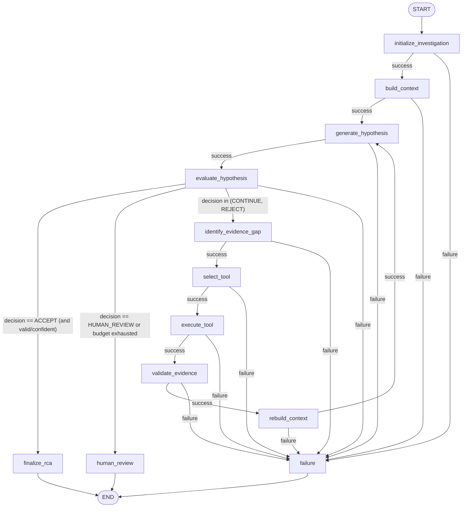

# Orchestration Layer Architecture — Bounded LangGraph Investigation Engine

This document details the architecture, state transition topology, and boundary enforcement rules for the stateful SRE investigation workflow.

## 1. Graph Topology

The workflow is modeled as a bounded, deterministic state machine constructed using LangGraph. If any node encounters a failure, it immediately transitions to the `failure` node.

## 2. Node Execution and Exception Contract

Every node in the orchestration layer follows a strict try-catch boundary. Unhandled fatal node exceptions are caught and converted to a `FailureTerminalState` to ensure deterministic execution.

| Node Name | Success Target(s) | Exception Behavior Category | Failure Target |
|---|---|---|---|
| `initialize` | `build_context` | A: Caught & converted to `FailureTerminalState` | `failure` |
| `build_context` | `generate_hypothesis` | A: Caught & converted to `FailureTerminalState` | `failure` |
| `generate_hypothesis` | `evaluate_hypothesis` | A: Caught & converted to `FailureTerminalState` | `failure` |
| `evaluate_hypothesis` | `finalize_rca`, `human_review`, `identify_evidence_gap` | A: Caught & converted to `FailureTerminalState` | `failure` |
| `identify_evidence_gap` | `select_tool` | A: Caught & converted to `FailureTerminalState` | `failure` |
| `select_tool` | `execute_tool` | A: Caught & converted to `FailureTerminalState` | `failure` |
| `execute_tool` | `validate_evidence` | A: Caught & converted to `FailureTerminalState` | `failure` |
| `validate_evidence` | `rebuild_context` | A: Caught & converted to `FailureTerminalState` | `failure` |
| `rebuild_context` | `generate_hypothesis` | A: Caught & converted to `FailureTerminalState` | `failure` |
| `finalize_rca` | `END` | A: Caught & converted to `FailureTerminalState` | `END` (sets failure payload) |
| `human_review` | `END` | A: Caught & converted to `FailureTerminalState` | `END` (sets failure payload) |
| `failure` | `END` | A: Logged & returned | `END` |

* **Category A (Non-Terminal Nodes)**: The node catches any exception internally, writes a `FailureTerminalState` payload into the state, and returns. Conditional routing inspects this and transitions to the `failure` node.
* **Category A (Terminal Nodes - `finalize_rca`, `human_review`)**: The node catches any exception internally, writes a `FailureTerminalState` payload into the state, sets a failed `termination_reason` (e.g. `"Finalization failure"` or `"Human review escalation failure"`), and transitions directly to `END` via static edges (does not traverse the `failure` node).

## 3. Graph State Schema

The runtime state is strongly typed and represented by the `InvestigationState` TypedDict:

- `investigation_id`: Unique stable identifier of the investigation.
- `incident`: The initial `IncidentRecord` domain model.
- `iteration_count`: Tracks the number of RCA hypothesis generation passes.
- `tool_call_count`: Tracks the number of diagnostic tool executions.
- `context_rebuild_count`: Tracks the number of `InvestigationContext` reconstructions.
- `evidence_list`: Accumulated list of canonical, normalized `Evidence` objects.
- `investigation_context`: Current built budget-enforced context.
- `current_rca`: The latest model-generated `RCADecisionResponse`.
- `critic_decision`: The latest review feedback (`CriticDecisionResponse`).
- `tool_selection`: The selected tool to run next (`ToolSelectionDecision`).
- `termination_reason`: Description of graph exit state.
- `human_review`: Payload for human escalation (`HumanReviewTerminalState`).
- `failure`: Payload representing fatal errors (`FailureTerminalState`).

## 4. Boundary & Resource Budget Limits

To prevent open-ended loops, the engine enforces strict limits configured in `app/config.py`:

- **Max Iterations** (`INVESTIGATION_MAX_ITERATIONS` = 3): The graph will execute at most 3 cycles of hypothesis generation and review before automatically escalating.
- **Max Tool Calls** (`INVESTIGATION_MAX_TOOL_CALLS` = 6): Prevents SRE resource exhaustion.
- **Max Context Rebuilds** (`INVESTIGATION_MAX_CONTEXT_REBUILDS` = 3): Limits the overhead of re-ranking and hybrid retrieval execution.
- **Max Evidence Items** (`INVESTIGATION_MAX_EVIDENCE_ITEMS` = 100): Caps size of state memory payloads.

## 5. Critic Routing Allowlist

To prevent model-controlled arbitrary routing, the `route_after_evaluation` function only routes to a hardcoded allowlist of targets based on critic decisions.

| Critic Decision | Validation / Confidence | Next Routed State / Node |
|---|---|---|
| `ACCEPT` | `is_valid` is `True` AND `confidence_score >= INVESTIGATION_CONFIDENCE_THRESHOLD` | `finalize_rca` |
| `ACCEPT` | `is_valid` is `False` OR `confidence` below threshold | Demoted to `CONTINUE_INVESTIGATION` -> `identify_evidence_gap` |
| `CONTINUE_INVESTIGATION` | Iteration count < max budgets | `identify_evidence_gap` |
| `CONTINUE_INVESTIGATION` | Iteration count >= max budgets | `human_review` |
| `REJECT` | Iteration count < max budgets | `identify_evidence_gap` |
| `REJECT` | Iteration count >= max budgets | `human_review` |
| `HUMAN_REVIEW` | Any | `human_review` |
| *Unsupported / Invalid Decision* | Any | Falls back defensively to `human_review` |

## 6. Error Handling and Rejections

- **Tool Allowlist Validation**: Before executing any tool, the tool name is validated against the registry. Unknown tools result in a `TOOL_NOT_FOUND` state, terminating via `failure`.
- **Parameter Constraints**: Tool arguments are parsed using the tool's strict `args_model` Pydantic class. Any mismatch raises a `TOOL_PARAMETER_INVALID` error, routing to `failure`.
- **Gateway Boundary**: The `LLMGateway` remains the only execution boundary for LLM interaction; no node invokes provider API endpoints directly.
