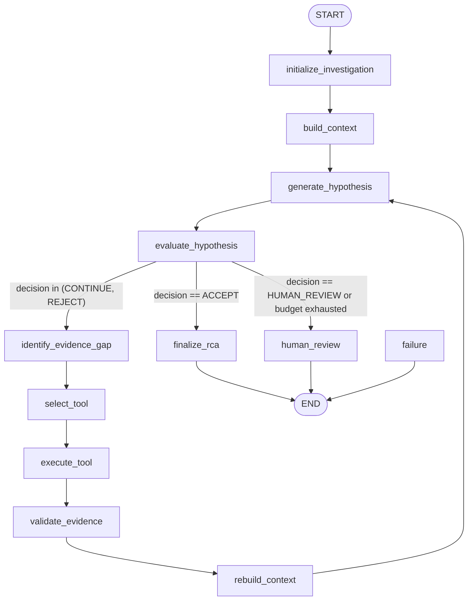

# Orchestration Layer Architecture — Bounded LangGraph Investigation Engine

This document details the architecture, state transition topology, and boundary enforcement rules for the stateful SRE investigation workflow.

## 1. Graph Topology

The workflow is modeled as a bounded, deterministic state machine constructed using LangGraph.

## 2. Graph State Schema

The runtime state is strongly typed and represented by the `InvestigationState` TypedDict:

- `investigation_id`: Unique stable identifier of the investigation.
- `incident`: The initial `IncidentRecord` domain model.
- `iteration_count`: Tracks the number of RCA hypothesis generation passes.
- `tool_call_count`: Tracks the number of diagnostic tool executions.
- `context_rebuild_count`: Tracks the number of `InvestigationContext` reconstructions.
- `evidence_list`: Accumulated list of canonical, normalized `Evidence` objects.
- `investigation_context`: Current built budget-enforced context.
- `current_rca`: The latest model-generated `RCADecisionResponse`.
- `critic_decision`: The latest review feedback (`CriticDecisionResponse`).
- `tool_selection`: The selected tool to run next (`ToolSelectionDecision`).
- `termination_reason`: Description of graph exit state.
- `human_review`: Payload for human escalation (`HumanReviewTerminalState`).
- `failure`: Payload representing fatal errors (`FailureTerminalState`).

## 3. Boundary & Resource Budget Limits

To prevent open-ended loops, the engine enforces strict limits configured in `app/config.py`:

- **Max Iterations** (`INVESTIGATION_MAX_ITERATIONS` = 3): The graph will execute at most 3 cycles of hypothesis generation and review before automatically escalating.
- **Max Tool Calls** (`INVESTIGATION_MAX_TOOL_CALLS` = 6): Prevents SRE resource exhaustion.
- **Max Context Rebuilds** (`INVESTIGATION_MAX_CONTEXT_REBUILDS` = 3): Limits the overhead of re-ranking and hybrid retrieval execution.
- **Max Evidence Items** (`INVESTIGATION_MAX_EVIDENCE_ITEMS` = 100): Caps size of state memory payloads.

## 4. Error Handling and Rejections

- **Tool Allowlist Validation**: Before executing any tool, the tool name is validated against the registry. Unknown tools result in a `TOOL_NOT_FOUND` state, terminating via `failure`.
- **Parameter Constraints**: Tool arguments are parsed using the tool's strict `args_model` Pydantic class. Any mismatch raises a `TOOL_PARAMETER_INVALID` error, routing to `failure`.
- **Gateway Boundary**: The `LLMGateway` remains the only execution boundary for LLM interaction; no node invokes provider API endpoints directly.
