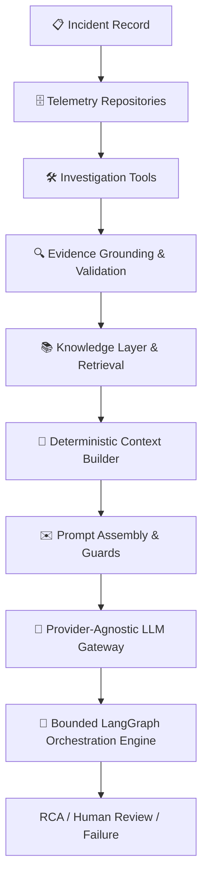

# OpsGraph AI

OpsGraph AI is a bounded, evidence-grounded investigation engine for SRE incident analysis and root-cause reasoning. The project combines:

*   **Structured Telemetry Access**: Controlled read-only queries against system metrics, logs, traces, topology, and deployments.
*   **Evidence Grounding & Validation**: Provenance checks and schema validation for diagnostic discoveries.
*   **Hybrid Operational Knowledge Retrieval**: Dual-path retrieval using semantic vector search and lexical fallback search.
*   **Deterministic Context Construction**: Context compilation with strict token budgets and reranking.
*   **Provider-Agnostic LLM Execution**: Decoupled gateway layer with retries and single-transition fallback.
*   **Deterministic Guardrails**: Hard constraints on input prompts and structured JSON outputs.
*   **Bounded LangGraph Orchestration**: State-graph orchestration limiting loop depths and resource consumption.
*   **Explicit Terminal States**: Predictable exit paths for root-cause analysis (RCA) finalization, human escalation, and fatal failures.

> [!NOTE]
> OpsGraph AI is an experimental developer scaffold designed to investigate engineering controls for model-driven SRE troubleshooting. It is not an autonomous replacement for production human operations.

---

## 1. Problem Statement

Modern incident resolution requires SREs to manually correlate diverse data sources—including telemetry metrics, logs, distributed traces, system topology, deployment records, runbooks, and historical incident post-mortems. This manual analysis introduces delay and increases Mean Time to Resolution (MTTR).

OpsGraph AI structures this process as a bounded, deterministic investigation workflow. The system collects telemetry evidence, validates data provenance, builds token-budgeted context, generates root-cause hypotheses, and subjects them to critic evaluation. It enforces strict computational budgets at every step, safely finalizing the analysis, requesting human review when stuck, or terminating cleanly on failure.

---

## 2. System Architecture Overview

The diagram below represents the sequential telemetry ingestion, validation, gateway, and orchestration topology:



---

## 3. Project Roadmap and Phase Status

*   **Phase 1 — Foundations and Schemas**: Core telemetry data schemas and incident definitions. **[RELEASED]**
*   **Phase 2 — Telemetry Repository Layer**: In-memory query repositories for logs, metrics, traces, and topology. **[RELEASED]**
*   **Phase 3 — Investigation Tools**: Diagnostic tool wrappers with Pydantic argument boundaries. **[RELEASED]**
*   **Phase 4 — Evidence Grounding and Validation**: Proof validation and source-of-truth grounding. **[RELEASED]**
*   **Phase 5 — Enterprise Knowledge Layer**: Hybrid Qdrant and SentenceTransformers operational knowledge store. **[RELEASED]**
*   **Phase 6 — Deterministic Context Builder**: Latency budgeting and FlashRank re-ranking compilation. **[RELEASED]**
*   **Phase 7 — Prompt Assembly & LLM Gateway**: Custom templates, input/output guards, and SDK gateways. **[RELEASED — v0.7.0]**
*   **Phase 8 — Bounded LangGraph Orchestration**: Stateful SRE orchestration loop. **[RELEASED — v0.8.0]**
*   **Phase 9 — Planned / Not Started**

---

## 4. Phase 8 Capabilities and Execution Boundaries

The LangGraph investigation engine enforces strict runtime budgets to guarantee termination:

*   **State Representation**: Typed `InvestigationState` tracking diagnostic histories and iteration limits.
*   **Budget Limits**:
    *   *Maximum Investigation Iterations*: 3
    *   *Maximum Diagnostic Tool Calls*: 6
    *   *Maximum Context Rebuilds*: 3
    *   *Maximum Stored Evidence Items*: 100
*   **Critic Logic**: An automated evaluation step comparing confidence against a target threshold (0.80).
*   **Deterministic Routing**: Allowlisted state transitions to prevent arbitrary node navigation.
*   **Tool Execution Constraints**: All diagnostic tools must pass parameter validation against strict Pydantic schemas.
*   **Exception & Failure Contracts**:
    *   *Non-Terminal Node Failure*: Exceptions in intermediate nodes populate a failure payload and transition via conditional edges to the `failure` node -> `END`.
    *   *Terminal Node Exception*: Exceptions in terminal nodes (`finalize_rca`, `human_review`) catch errors, retain the failure payload, set a failed `termination_reason`, and transition directly to `END` without traversing the `failure` node.

---

## 5. LLM Gateway & Embedding Architecture

### LLM Gateway Routing
Model generation tasks are decoupled behind the custom `LLMGateway`. Nodes do not invoke provider SDKs directly.
*   **Primary Provider**: Groq (`llama-3.3-70b-versatile`)
*   **Backup Fallback**: Gemini (`gemini-2.5-flash`)
*   **Resiliency**: Gateway retries transient errors (429 rate limits, connection timeouts) with exponential backoff. If retries are exhausted, it switches to the backup provider. Permanent errors raise `GatewayError` immediately and exit safely without exposing credentials.

### Embedding Architecture
Knowledge indexing and query embedding are separated from generation configurations:
*   **Primary Embedding Model**: Gemini `models/gemini-embedding-2-preview` (3072 dimensions)
*   **Local Fallback Model**: SentenceTransformers `all-mpnet-base-v2` (768 dimensions)
*   **Vector Isolation (Strategy A)**: Dual vector collections are maintained in Qdrant based on dimension matching to prevent vector corruption.
*   **Operational Limitation**: The local fallback collection remains empty at runtime unless local fallback indexing has been executed separately.

---

## 6. Installation and Setup

Setup instructions for Windows PowerShell:

### 1. Clone & Initialize Environment
```powershell
# Clone the repository
git clone https://github.com/manish930s/OpsGraph.git
cd opsgraph-ai

# Create virtual environment
python -m venv venv

# Activate virtual environment
.\venv\Scripts\activate

# Install dependencies
pip install -r requirements.txt
```

### 2. Configure Settings
Copy `.env.example` to `.env` and populate credentials (use placeholders only; do not commit keys):
```env
GROQ_API_KEY="your-groq-key"
GEMINI_API_KEY="your-gemini-key"
QDRANT_URL="https://your-qdrant-instance"
QDRANT_API_KEY="your-qdrant-key"
```

---

## 7. Verification and Testing

Verify the workspace using the offline test suite. All tests execute using mock provider adapter modes.

### Run Full Offline Suite
```powershell
.\venv\Scripts\python.exe -m pytest
```
*v0.8.0 Release Verification Baseline:*
*   **Collected**: 118
*   **Passed**: 116
*   **Failed**: 0
*   **Skipped**: 2 (integration live provider smoke tests)

### Run Orchestration Suite
```powershell
.\venv\Scripts\python.exe -m pytest tests/unit/test_orchestration.py -v
```
*v0.8.0 Release Verification Baseline:*
*   **Passed**: 20

---

## 8. Repository Structure

*   `app/schemas/`: Pydantic telemetry models and structured gateway definitions.
*   `app/services/context/`: ContextBuilder and FlashRank re-ranking logic.
*   `app/services/evidence/`: Evidence schema validation and deduplication services.
*   `app/services/retrieval/`: Vector retrieval adapters and Strategry A collection managers.
*   `app/services/gateway/`: Decoupled `LLMGateway` retries and provider mapping.
*   `app/services/guardrails/`: Input/Output validation facade rules.
*   `app/services/orchestration/`: LangGraph StateGraph, nodes, and conditional edges.
*   `app/tools/`: Telemetry connectors (metrics, logs, traces, topology, windowing).
*   `prompts/`: Versioned RCA prompts and tool selection templates.
*   `DATA/`: Sample incident data and grounding records.
*   `DOCS/`: Release reports and historical migration documentation.
*   `PROJECT_CONTEXT/`: Deep-dive architectural references.
*   `tests/`: Unit and integration test suites.

---

## 9. Engineering Controls and Constraints

*   **Bounded Loops**: State machine execution limits prevent infinite loop execution.
*   **Allowlisted Tools**: Unrestricted discovery is blocked; tool registry enforces an execution boundary.
*   **Shell Isolation**: The system executes structured telemetry functions; no arbitrary shell executions are permitted.
*   **Input and Output Constraints**: Prompts use system tags to isolate untrusted user data, and outputs must parse to exact Pydantic model schemas.
*   **Secret Safety**: Node error handlers intercept exceptions and strip raw API keys or connection tokens before logging `FailureTerminalState` payloads.

---

## 10. Known Limitations

*   **NeMo Guardrails**: Currently deferred because of Windows compatibility and Python 3.14 lifecycle constraints.
*   **Fallback Collection**: Embedding fallback requires separate local index population.
*   **Token Budgeting**: Approximate budget enforcement uses word counts rather than model BPE tokenizers.
*   **Metadata Gaps**: Token usage counts are not captured by custom provider adapters.
*   **Production Readiness**: No public web API or GUI is implemented. Evaluation relies on command-line pytest execution.
